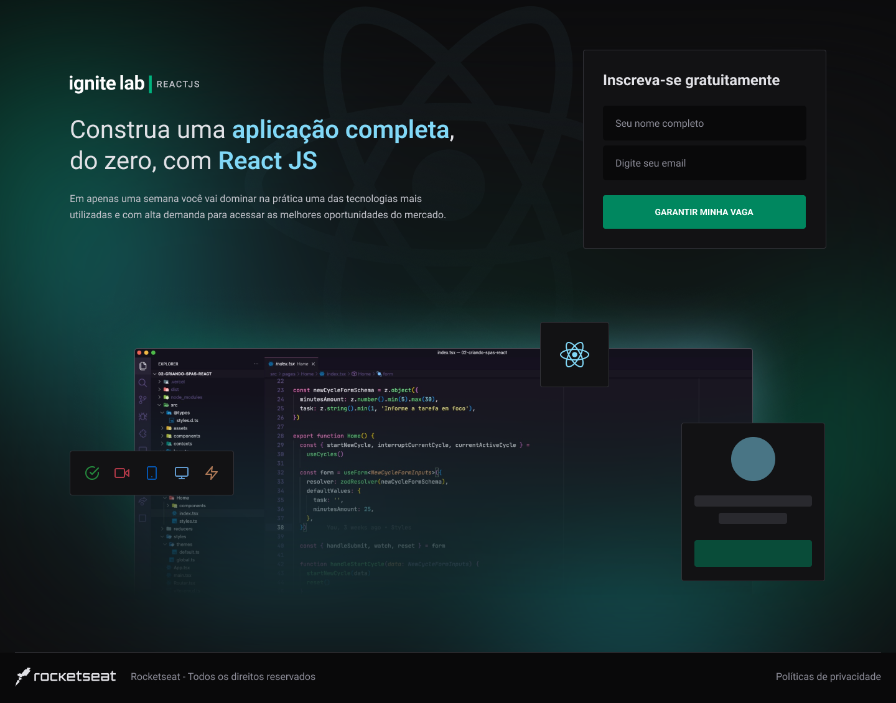
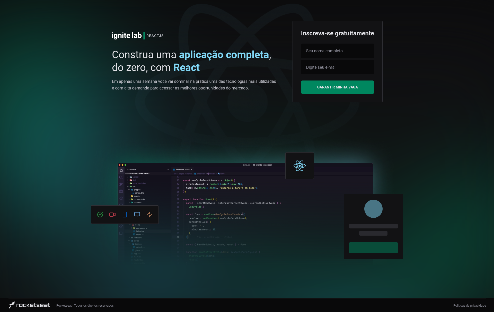
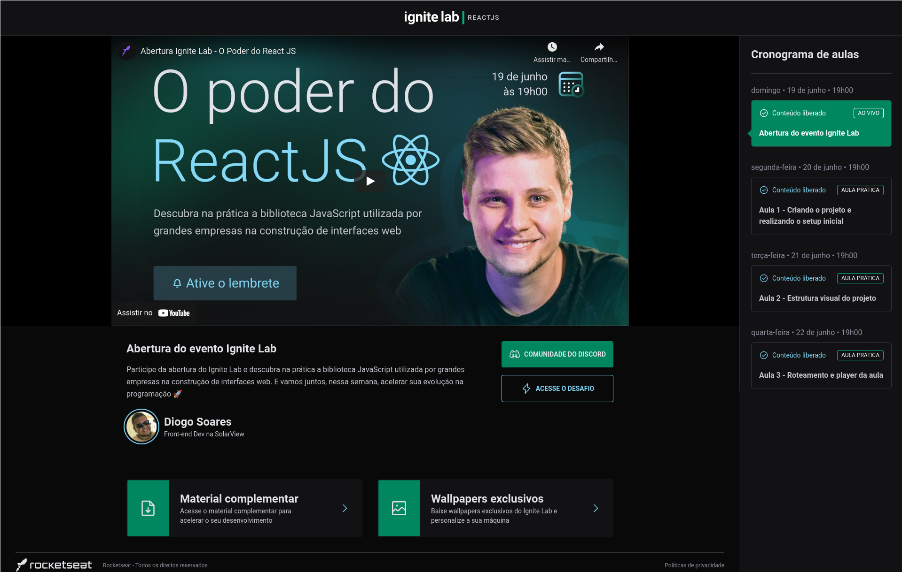

 

## 🛠 Skills

![react][react] ![graphql][graphql] ![apollo client][apollo] ![sass][sass] ![tailwind css][tailwind] ![vite][vite]

## 📄 Description

Projeto desenvolvido durante o evento IgniteLab da Rocketseat 🚀.
Projeto de plataforma de e-learning feito com ReactJS, GraphQL, GraphCMS e Tailwind

## 🌐 Live Version

## 🌠 Screenshots

## 🔗 More About Me

[react]: https://img.shields.io/badge/react-1E4174?style=for-the-badge&logo=react&logoColor=white&labelColor=81D8F7

[graphql]: https://img.shields.io/badge/graphql-1E4174?style=for-the-badge&logo=graphql&logoColor=white&labelColor=ff006e

[apollo]: https://img.shields.io/badge/apollo%20client-1E4174?style=for-the-badge&logo=apollographql&logoColor=white&labelColor=4909C2

[sass]: https://img.shields.io/badge/sass-1E4174?style=for-the-badge&logo=sass&logoColor=white&labelColor=ff99c8

[tailwind]: https://img.shields.io/badge/tailwind%20css-1E4174?style=for-the-badge&logo=tailwindcss&logoColor=white&labelColor=0EA5E9

[vite]: https://img.shields.io/badge/vite-1E4174?style=for-the-badge&logo=vite&logoColor=white&labelColor=FFD028
